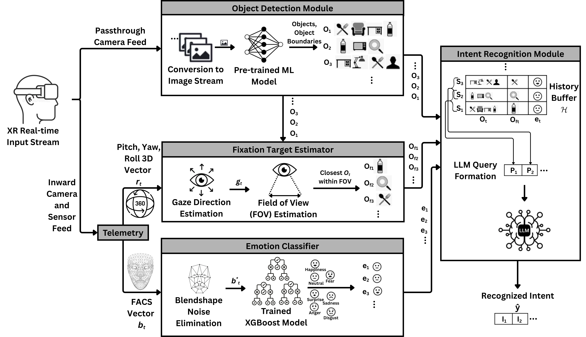

# SeeIntent: Real-Time Multimodal Intent Recognition in Mixed Reality

This repository contains the research prototype and supporting artifacts for the paper:

**Real-Time Multimodal Intent Recognition in Mixed Reality Using Spatio-Temporal LLM**  
Gathik Jindal, Jayant Sharma, Beryl Gnanaraj, and Jaya Sreevalsan-Nair  
Graphics-Visualization-Computing Lab, IIIT Bangalore

Paper PDF: [Emotion_Intent_Detection_Using_Eye_Tracking_with_VR_Headset__ETTAC_2026_.pdf](Emotion_Intent_Detection_Using_Eye_Tracking_with_VR_Headset__ETTAC_2026_.pdf)

SeeIntent is an end-to-end Mixed Reality (MR) intent-recognition pipeline for egocentric user perspective. It combines scene-level object detection, facial-expression based emotion classification, fixation/focus estimation, and a temporal Large Language Model (LLM) reasoning module to predict immediate user intent from recent multimodal state history.

<p align="center">
  
</p>
<p align="center"><em>SeeIntent architecture. The XR input stream feeds the object detection module, fixation target estimator, and emotion classifier. Their outputs are stored as states in a history buffer that is serialized into LLM prompts to produce the recognized intent.</em></p>

## Research Summary

The system is designed for real-time MR interaction analysis where intent depends on what the user sees, how the user feels, and where the user is directing attention. At each timestep, SeeIntent builds a state vector:

```text
s_t = (emotion_t, objects_t, fixation_target_t)
```

These state vectors are stored in a rolling temporal context window by the `Brain` module and serialized into a structured prompt for an LLM backend. The LLM predicts the user's immediate next action as a natural-language intent phrase.

Primary components:

- **Object detection:** YOLOv11n detects objects from egocentric MR casting frames.
- **Emotion recognition:** A 22-feature XGBoost classifier predicts facial emotion from a 63-dimensional FACS/blendshape vector.
- **Fixation estimation:** Center-view and head-orientation cues estimate the object of attention.
- **Temporal reasoning:** A rolling history buffer conditions LLM inference on recent multimodal context.
- **Evaluation:** Benchmarks are provided for EPIC-KITCHENS style egocentric action data and an in-the-wild Meta Quest pilot dataset.

<p align="center">
  
</p>
<p align="center"><em>YOLOv11n detections on egocentric frames, with the estimated field of view (FOV) marked by the dashed circle. The fixation target is the closest detected object inside the FOV.</em></p>

## Contributions Reflected in This Repository

- A modular real-time MR pipeline for multimodal intent recognition.
- A CPU-efficient XGBoost facial-emotion classifier trained on FACS/blendshape data from the Emoji Hero VR dataset.
- A temporal "Brain" architecture that stores recent multimodal states and queries local or optional cloud LLM backends.
- Pilot annotations for headset-captured MR recordings in `dataset/`.
- Benchmark scripts and saved evaluation outputs in `benchmark_results/`.

## Repository Structure

```text
.
|-- README.md
|-- requirements.txt
|-- Emotion_Intent_Detection_Using_Eye_Tracking_with_VR_Headset__ETTAC_2026_.pdf
|-- assets/
|   |-- architecture.png
|   `-- object_detection_fov.png
|-- dataset/
|   |-- com.oculus.vrshell-*.mp4
|   `-- truth_com.oculus.vrshell-*.json
|-- emoji-hero-vr-db-sfea-as-csv/
|   |-- training_set.csv
|   |-- validation_set.csv
|   `-- test_set.csv
|-- benchmark_results/
|   |-- aggregate_*.json
|   |-- raw_*.json
|   |-- chart_*.png
|   `-- report_*.html
|-- models/
|   `-- yolo11n.pt
`-- src/
    |-- main.py
    |-- brain.py
    |-- emotion_classifier.py
    |-- train_model.py
    |-- yolo_detector.py
    |-- udp_listener.py
    |-- window_capture.py
    |-- benchmark.py
    |-- benchmark_oculus.py
    |-- evaluate.py
    `-- models/
        |-- xgb_custom_model.pkl
        |-- label_encoder.pkl
        |-- top_feature_indices.pkl
        `-- yolo11n.pt
```

## System Requirements

Recommended environment:

- Windows 10/11 for live MR window capture through `pywin32`.
- Python 3.10 or newer.
- CUDA-capable GPU recommended for YOLO and local LLM inference.
- Meta Quest Pro or a compatible headset exposing face tracking/head rotation through a Unity or similar client.
- Ollama for local LLM inference.

The live application expects:

- A casting window titled `Meta Quest Casting`.
- UDP telemetry packets on `127.0.0.1:5005`.
- Each UDP packet to include:
  - `FaceWeights`: list of 63 FACS/blendshape values.
  - `HeadRotX`, `HeadRotY`, `HeadRotZ`: head-rotation values.

## Installation

Create and activate a virtual environment:

```bash
python -m venv .venv
.venv\Scripts\activate
```

Install PyTorch according to your CUDA configuration. For CUDA 12.x drivers, the CUDA 12.1 PyTorch wheels are commonly compatible:

```bash
pip install torch torchvision torchaudio --index-url https://download.pytorch.org/whl/cu121
```

Install the remaining dependencies:

```bash
pip install -r requirements.txt
```

Install the XGBoost runtime used by the saved emotion classifier:

```bash
pip install xgboost
```

If retraining the emotion classifier, also install the plotting dependency used by `src/train_model.py`:

```bash
pip install seaborn
```

## Running the Live MR Pipeline

Start an Ollama server and pull a supported model:

```bash
ollama serve
ollama pull llama3.2
```

Optionally create a `.env` file:

```text
BRAIN_BACKEND=ollama
OLLAMA_MODEL=llama3.2
```

Run the live system from the repository root:

```bash
python src/main.py
```

Runtime controls:

- Press `s` in the OpenCV window to toggle continuous LLM intent prediction.
- Press `q` to stop the live loop.

During execution, the system captures the `Meta Quest Casting` window, performs YOLO-based scene analysis, receives headset telemetry over UDP, classifies facial emotion, estimates the center-view fixation target, and sends rolling state history to the `Brain` module.

## Emotion Classifier

The facial emotion model is implemented in [src/emotion_classifier.py](src/emotion_classifier.py). It loads:

- [src/models/xgb_custom_model.pkl](src/models/xgb_custom_model.pkl)
- [src/models/label_encoder.pkl](src/models/label_encoder.pkl)
- [src/models/top_feature_indices.pkl](src/models/top_feature_indices.pkl)

The training workflow is implemented in [src/train_model.py](src/train_model.py). It uses the CSV splits in `emoji-hero-vr-db-sfea-as-csv/`, merges anger and disgust into a single `Hostile` class, performs two-stage feature selection, and trains an XGBoost classifier on the selected blendshape subset.

The paper reports:

- 63 input FACS/blendshape values from headset telemetry.
- 22 selected features after feature-importance based reduction.
- Six output classes: `Fear`, `Happiness`, `Hostile`, `Neutral`, `Sadness`, and `Surprise`.
- Test accuracy of **78.84%** for the optimized 22-feature XGBoost classifier.
- CPU inference time of approximately **1-2 ms** per emotion prediction.

Retrain the model:

```bash
python src/train_model.py
```

Note: the training script saves artifacts in the current working directory. Move regenerated files into `src/models/` before using them with the live pipeline.

## Benchmarking and Evaluation

This repository includes two evaluation paths.

### EPIC-KITCHENS Style Benchmark

[src/benchmark.py](src/benchmark.py) benchmarks intent prediction on EPIC-KITCHENS style egocentric activity annotations using YOLO detections and local Ollama LLMs.

```bash
python src/benchmark.py --models llama3.2 mistral gemma3:4b phi4-mini qwen2.5:3b
python src/evaluate.py
```

Important: `src/benchmark.py` contains local dataset paths from the original experiment. Update `DATASET_ROOT`, `RESULTS_DIR`, and the Ollama URL in the script before reproducing the EPIC-KITCHENS run on a new machine.

Saved aggregate results from the paper-aligned run are available in [benchmark_results/aggregate_20260421_133839.json](benchmark_results/aggregate_20260421_133839.json).

| Model | BLEU-1 | ROUGE-L | Verb Match | Noun Match | Hallucination | Latency |
| --- | ---: | ---: | ---: | ---: | ---: | ---: |
| llama3.2 | 0.0037 | 0.0150 | 0.00% | 0.66% | 0.8021 | 0.179 s |
| mistral | 0.0097 | 0.0189 | 0.21% | 2.00% | 0.7064 | 0.275 s |
| gemma3:4b | 0.0073 | 0.0144 | 0.24% | 2.29% | 0.7812 | 2.538 s |
| phi4-mini | 0.0082 | 0.0133 | 0.29% | 1.79% | 0.6419 | 1.987 s |
| qwen2.5:3b | 0.0034 | 0.0053 | 0.00% | 1.07% | 0.6902 | 1.921 s |

### In-the-Wild Meta Quest Pilot Benchmark

[src/benchmark_oculus.py](src/benchmark_oculus.py) evaluates the headset-captured pilot recordings against manually annotated JSON segments. The packaged recordings and truth files are in `dataset/`.

```bash
python src/benchmark_oculus.py --models llama3.2 mistral gemma3:4b
```

Important: `src/benchmark_oculus.py` currently points to the original capture directory used during experimentation. Set `CAPTURE_DIR = Path("./dataset")` before running against the bundled files.

Saved aggregate pilot results are available in [benchmark_results/aggregate_20260510_212909.json](benchmark_results/aggregate_20260510_212909.json).

| Model | BLEU-1 | ROUGE-L | Verb Match | Noun Match | Latency |
| --- | ---: | ---: | ---: | ---: | ---: |
| llama3.2 | 0.0694 | 0.0784 | 0.00% | 0.00% | 2.378 s |
| mistral | 0.0583 | 0.0761 | 0.00% | 0.00% | 2.521 s |
| gemma3:4b | 0.0749 | 0.0949 | 0.00% | 0.00% | 2.501 s |

## Data and Artifacts

The `dataset/` directory contains four short Meta Quest MR recordings and manually annotated JSON files. Each annotation stores:

- `ground_truth`: verb-noun action phrase.
- `duration_s`: temporal segment duration.
- `gt_verb`: primary action verb.
- `gt_noun`: primary object noun.
- `emotion`: annotated facial/emotional state.

The `emoji-hero-vr-db-sfea-as-csv/` directory contains CSV splits used for the emotion-recognition workflow.

The `benchmark_results/` directory contains raw benchmark outputs, aggregate metric files, charts, and an HTML report generated by the evaluation scripts.

## Reproducibility Notes

- Live MR capture is Windows-specific because [src/window_capture.py](src/window_capture.py) uses Win32 APIs.
- UDP telemetry requires a Unity or equivalent headset client. That client is not included in this repository.
- EPIC-KITCHENS videos and annotations are not redistributed here; download them from the official dataset source and update local paths in `src/benchmark.py`.
- LLM outputs may vary across model versions, quantization settings, hardware, and Ollama configuration.
- Some scripts contain local paths from the original experimental machine; adjust these before rerunning experiments.

## Limitations

This repository is a research prototype. The pilot dataset is intentionally small and should be treated as proof-of-concept evidence for end-to-end feasibility rather than a generalization claim. Exact verb/noun match metrics are strict and can understate semantically reasonable predictions when object detections use generic categories. The paper discusses this as a semantic bottleneck introduced by closed-vocabulary object detection.

## Citation

If you use this repository, dataset, or benchmark artifacts, please cite the accompanying paper:

```bibtex
@inproceedings{jindal2026seeintent,
  title     = {Real-Time Multimodal Intent Recognition in Mixed Reality Using Spatio-Temporal LLM},
  author    = {Jindal, Gathik and Sharma, Jayant and Gnanaraj, Beryl and Sreevalsan-Nair, Jaya},
  year      = {2026},
  institution = {Graphics-Visualization-Computing Lab, IIIT Bangalore},
  note      = {SeeIntent research prototype}
}
```

Please update the venue, proceedings, DOI, and page numbers once the final publication metadata is available.

## License and Ethics

No license file is currently included. Contact the authors before redistributing code, data, or model artifacts outside academic review or collaboration contexts.

The project uses facial-expression and egocentric video signals. Any extension of this work should obtain informed consent, minimize personally identifiable recordings, and follow institutional data-governance requirements for human-subject and biometric data.
